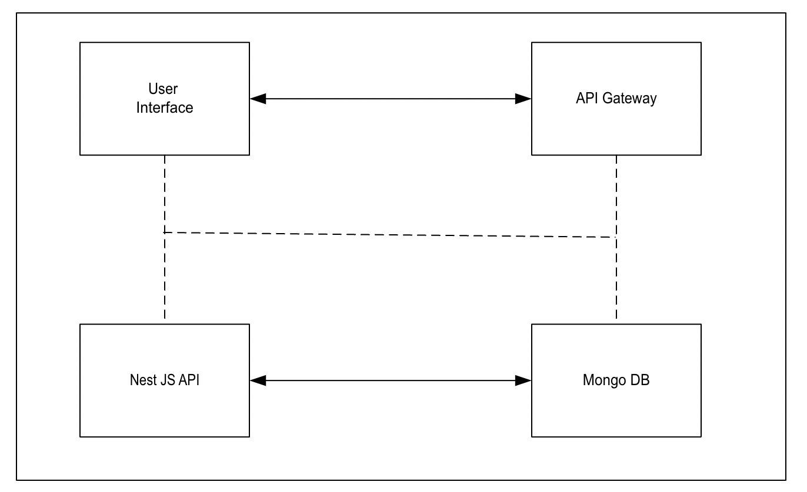

# Detailed Architecture Understanding

**Steps to run the application**

1. **Load “React App/user-authentication-backend” in Visual Studio. Click New terminal enter command “mpm install” and “npm run start”**
1. **Load “React App/user-authentication” in Visual Studio. Click New terminal enter command “mpm install” and “npm run serve”**

**Conceptual Diagram**

**Components Description**

1. User Interface (React):
   1. Sign Up Page: Contains a form for email, name, and password. Validates password requirements.
   1. Sign In Page: Contains a form for email and password.
   1. Application Page: Displays a welcome message after successful authentication.
1. Static File Hosting (AWS S3):
   1. Hosts the built static files (HTML, CSS, JS) of the React application.
1. Content Delivery Network (AWS CloudFront):
   1. Distributes the static content hosted on S3 for faster load times globally.
1. API Gateway (AWS API Gateway):
   1. Acts as a single entry point for the frontend to communicate with the backend.
   1. Routes requests to the appropriate backend services (NestJS API).
1. Backend Application (NestJS API):
   1. Authentication Module: Handles user sign-up and sign-in requests.
   1. Endpoints:
      1. POST /signup: For user registration.
      1. POST /signin: For user login.
   1. Implements validation, logging, and security best practices.
1. Database (MongoDB):
   1. Stores user data (email, name, password) securely.
   1. Passwords should be hashed before storage for security.
1. Logging (AWS CloudWatch):
   1. Monitors and logs application events, errors, and performance metrics.
   1. Helps in debugging and monitoring the health of the application.
1. Security (AWS IAM):
   1. Manages access to AWS services and resources securely.
   1. Ensures that only authorized users and services can access resources.

**Sequence Diagram**

**Sequence of Operations**

**The sequence of operations during user sign-up and sign-in is as follows:**

**Sign-Up Process**

1. User Interaction: The user fills out the sign-up form in the React application.
1. Form Submission: The frontend sends a POST request to the API Gateway (/signup endpoint).
1. API Gateway: Routes the request to the NestJS API.
1. NestJS API:*
   1. Validates the input data (email, name, password).
   1. Check if the email is already in use.
   1. Hashes the password and stores the user data in MongoDB.
1. **Response: Sends a success response back to the frontend.
1. **Frontend Redirect: Redirects the user to the application page with a welcome message.

**Sign-In Process**

1. User Interaction: The user fills out the sign-in form in the React application.
1. Form Submission: The frontend sends a POST request to the API Gateway (/signin endpoint).
1. API Gateway: Routes the request to the NestJS API.
1. NestJS API:
   1. Validates the input data (email, password).
   1. Checks credentials against the database.
   1. If successful, generates a JWT token for session management.
1. Response: Send the JWT token back to the frontend.
1. Frontend Store: Stores the token (in local storage or cookies) for authenticated requests.

**Detailed Explanation of Components**

1. User Interface (React):
   1. The frontend application where users interact with the sign-up and sign-in forms.
1. API Gateway (AWS API Gateway/ Azure API Gateway/ Ocelot API Gateway):
   1. Acts as a single entry point for all client requests, routing them to the appropriate backend service.
   1. Provides security features like throttling and authorization.
1. Authentication Service (NestJS API):
   1. Handles user authentication and authorization logic.
   1. Provides endpoints for signing up and signing in, interacting with the MongoDB database.
1. Database (MongoDB Atlas):
   1. Stores user credentials securely, ensuring data integrity and security. Can use Secret Managers for the same and make sure the connection strings are controlled and secured.
   1. Supports user retrieval and validation during sign-in.
1. AWS Infrastructure:
   1. VPC: Isolated network to host your application services securely.
   1. EC2 Instances: Host the NestJS API to handle backend logic.
   1. RDS (MongoDB): Managed database service for storing user information.
   1. S3: Used to host static files (React/Vue app).
   1. CloudFront: CDN for distributing and caching static files for faster access.
   1. API Gateway: Manages and routes requests to the backend services.

**Implementation Considerations**

- Security Best Practices: Ensuring that sensitive data (like passwords) are hashed and stored securely. Must use HTTPS for secure data transmission.
- Logging: Implement logging mechanisms in the NestJS API to monitor requests and errors. Can use App Insights in case of Azure, Data Dog in case of Cloud Agnostic
- Error Handling: Proper error handling should be implemented in both frontend and backend for better user experience and debugging.
- Performance: Utilize caching strategies (e.g., Redis) for frequently accessed data to enhance performance.

**Conclusion**

This architecture provides a comprehensive overview of how a full-stack user authentication module can be implemented using AWS infrastructure. It outlines the components involved, their interactions, and how they are hosted in a cloud environment. This design ensures scalability, security, and efficient user management within the application. If you need further customization or additional details, feel free to ask!
